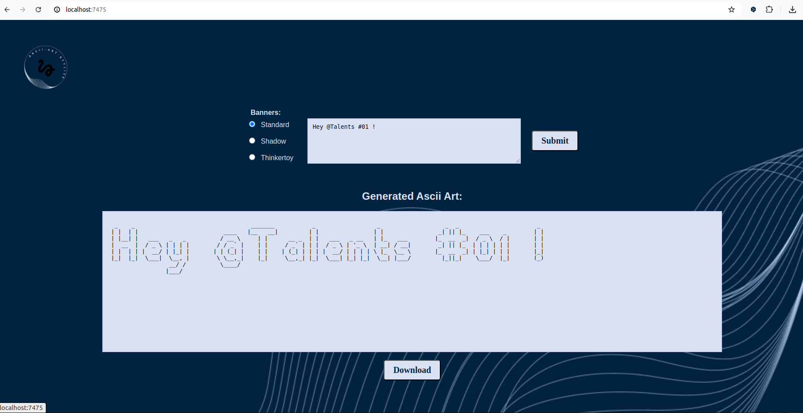

# ASCII-ART-WEB-EXPORT

Ascii-art-web-export is made on top of [ascii-art-web](https://github.com/majnun917/Ascii-art-web) project, [stylize](https://github.com/majnun917/ascii-art-stylize) and [dockerize](https://github.com/majnun917/ascii-art-web-dockerize) integrated.

It consists on adding a feature that allows for exporting the output of the web application.

## Usage

### Prerequisites

- [Go](https://go.dev/doc/install) (the used server-side language)
- [Docker](https://docs.docker.com/get-docker/) (containerazation service)

### Installation

To use the program, follow these steps: 

1. Clone the repository:

```console
git clone <repository-URL>
cd <repository-name>
```
- Open your terminal and run the following command to launch the server:
```console
go run .
``` 
- Open your web browser and navigate to: 
```console
docker run -p 8080:8080 <name_of_image>
```

4. Open your web browser and navigate to: 

```
http://localhost:8080
``` 
The default port is 8080, but you can choose your port number:
```console
go run . -port <port number>
```
Then you need to navigate to:
```console
docker stop $(docker ps -aq)
```

- If you want to remove all containers from the docker machine, run this command:

```console
docker rm $(docker ps -aq)
```

- If you want to delete all existing Docker images, run this command:

```console
docker rmi $(docker images -q)
```

- If you want to execute bash commands inside a running container, run this command:

```console
docker exec -it container-name-or-id /bin/bash
```

- If you want to show the labels of an image, run this command:

```console
docker inspect --format='{{json .Config.Labels}}' image-name
```

- You can perfectly set up and run the project using the dedicated script:

```sh
sh dockerize.sh
```

This shell script automates the sequence of commands necessary to build the Docker image and run the Docker container. This ensures consistency and saves time by avoiding the need to manually enter each command. It provides a straightforward way to set up and run the project with a single command: ``sh build_run.sh``

### Web user interface

- Text entry field
- Radio buttons for banner selection
- Button to send a POST request to /ascii-art and display the result

Screenshot of the web page


## Implementation details

### Program algorithm

The algorithm transforms text into ASCII art using different banners. This algorithm follows several key steps:

1. **Loading banner templates:** each banner (Standard, Shadow, Thinkertoy) has a specific template which defines how each character should be represented in ASCII whose templates are stored in files via POST method.

2. **Reading input text:** the text to be converted into ASCII art is extracted from the data submitted via the web form using the POST method.

3. **Character conversion:** For each character in the input text, the algorithm searches for its ASCII representation in the selected banner template and this representation is added line by line to a new character string that will constitute the final ASCII art.

4. **Ascii final art:** the generated lines are combined to form the final Ascii art which is then sent to the HTML template for display on the web page.

### Web integration

1. **HTML Structure:** The web interface is built using HTML, providing a form where users can input the text they want to convert to ASCII art. The form also includes a list to select the desired banner style (Standard, Shadow, Thinkertoy). The output area displays the generated ASCII art.

2. **CSS Styling:** CSS is used to style the form and the output area, ensuring a user-friendly interface. It manages the layout, fonts, and responsivity to make the web application visually appealing.

### HTTP headers

The main web page holds a button to download a text file conatining the generated ascii art result with the right permissions (read and write) for the user. The Hypertext Transfer Protocol (HTTP) is the foundation of data communication for the World Wide Web (www). So, this feature is enhanced by the use of HTTP headers (Content-Disposition, Content-Type, and Content-Length). HTTP Headers are additional information sent by the client or server during an HTTP request or response. They are used to provide additional details about the transaction, request, message or response.

HTTP headers used in this project:

1. **Content-Disposition:** is used to tell the browser how to handle the content received. It specifies whether the content should be displayed in the browser, downloaded, or treated as an attachment.

2. **Content-Type:** indicates the MIME type of the request or response body. The MIME type indicates the nature and format of a document, file, or assortment of bytes. For example, “Content-Type: application/json” indicates that the message body is in JSON format.

3. **Content-Length:** indicates the size of the message body in bytes. This lets the server know how much data to expect. For example, “Content-Length: 1234” indicates that the message body is 1234 bytes long.

### Containerization

1. **Dockerfile:** A Dockerfile is used to containerize the application, allowing it to run consistently across different environments. The file includes instructions to compile the application code, build an image and define the entry point.

2. **Image and Container:** The application can be containerized by building the Docker image using the docker build command and then running the container with docker run. This makes the application easily deployable and scalable in different environments.

## About ASCII standard

ASCII is a character encoding standard used for representing text in computers and communication equipment. ASCII defines a set of 128 characters, including uppercase and lowercase letters, digits, punctuation marks, control characters (such as newline and tab), and non-printable characters. Each character in ASCII is represented by a 7-bit binary number (0-127), which allows for 128 unique characters.

The ASCII standard was first published in 1963 and has since become widely adopted as the de facto standard for character encoding in computing systems. ASCII characters are used to represent text in various applications, including text files, programming languages, communication protocols, and user interfaces. While ASCII is limited to representing characters from the English alphabet and some common symbols, it remains a fundamental encoding standard in computer systems.


## About HTTP response code status

- **200 OK**: Standard response for successful HTTP requests.

- **400 Bad Request**: The server cannot or will not process the request due to an apparent client error (e.g., malformed request syntax...).

- **404 Not Found**: The requested resource could not be found but may be available in the future.

- **500 Internal Server Error**: The server encountered an error and could not complete the request.

For more details, read: [HTTP status codes](https://en.wikipedia.org/wiki/List_of_HTTP_status_codes).

## Autors

- **Ndiasse Dieye**
- **Otchoun Agiel**
- **Abdelilah Sadiqui**

## License

This project is open-sourced under [the MIT License](https://opensource.org/license/mit).
